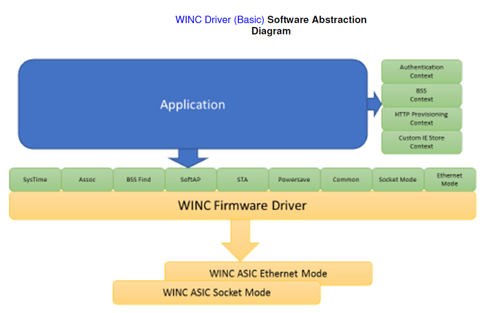
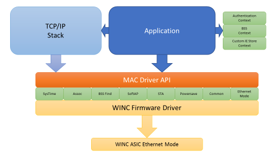
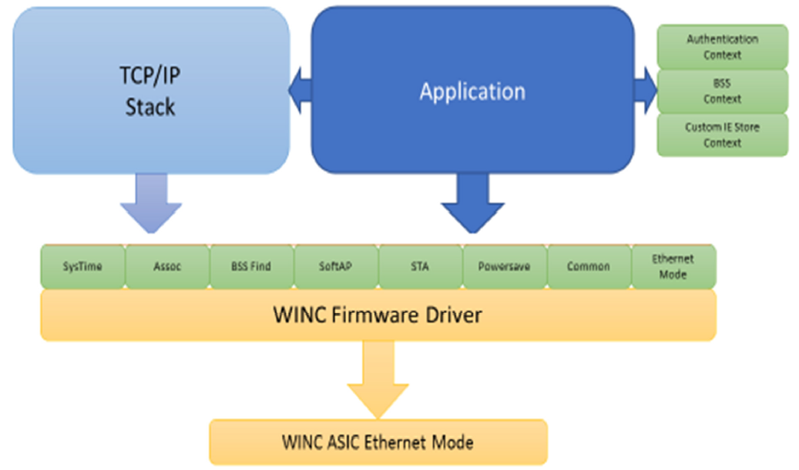
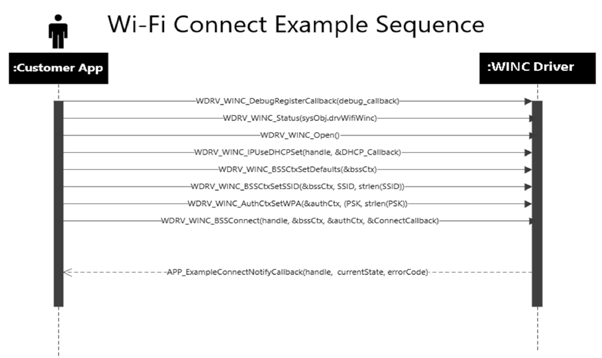

# WINC Driver Guide
## MPLAB Harmony Integrated Software Framework

## Introduction

This section describes the WINC Driver Library. This Driver supports both ATWINC1500 and ATWINC3400.

### Description

The MPLAB Harmony WINC Driver provides a high-level interface to the ATWINC1500 and ATWINC3400 Wi-Fi network
controller modules. The WINC Driver Library, in conjunction with the ATWINC1500 or ATWINC3400 module, allows an
application to:
• Join an existing 802.11 b/g/n 2.4GHz Wi-Fi Infrastructure network.
• Create an 802.11 Wi-Fi Ad Hoc of Soft AP network.
• Scan for other W-Fi devices in an area
• Supports BLE 4.0 provisioning and profiles in central and peripheral mode (ATWINC3400 only)

Microchip-Direct references/order codes:
• [SAMD21: ATSAMD21-XPRO](https://www.microchip.com/Developmenttools/ProductDetails/ATSAMe54-XPRO)
• [SAME54: ATSAME54-XPRO](https://www.microchip.com/Developmenttools/ProductDetails/ATSAMD21-XPRO)
• [WINC1500: ATWINC1500-XPRO](https://www.microchip.com/Developmenttools/ProductDetails/ATWINC1500-XPRO)
• [WINC3400: ATWINC3400-XPRO](https://www.microchip.com/Developmenttools/ProductDetails/ATWINC3400-XPRO)

## Using the Library

This topic describes the basic architecture of the WINC Driver Library and provides information and examples on how to use it.

### Description

Interface Header File: wdrv_winc_client_api.h
The interface to the WINC Driver Library is defined in the wdrv_winc_client_api.h header file. Any C language source (.c) file that uses the WINC Driver Library should include wdrv_winc_client_api.h.

Library Source Files:
The WINC Driver Library source files are provided in the <install-dir>/framework/driver/wifi/winc directory. This folder may contain optional files and alternate implementations. Please refer to Configuring the Library for instructions on how to select optional features and to Building the Library for instructions on how to build the library.

## Abstraction Model

This library provides an abstraction of the ATWINC1500 and ATWINC3400 network controllers. The library operates in two forms, a basic driver intended to work solely with an application and a MAC driver intended to work in concert with the Harmony TCP/IP stack and the application. In either form, the driver provides function to perform the following:
• Manage WINC system time
• Manage Wi-Fi associations
• Perform Wi-Fi BSS search operations
• Create and manage Soft AP functionality
• Connect to an existing 802.11 b/g/n infrastructure network
• Control device power save operation
• Manage security profiles
• Configure and control WINC network controllers

### Description

The WINC Driver library interface defines a superset abstraction of the functionality provided by any specific implementation or
configuration of the library. This topic describes how that abstraction is modeled in software and introduces the library's interface.
Refer to Configuring the Library to determine the actual set of features that are supported for each configuration option.

#### ASIC Socket vs Ethernet Mode

The WINC modules are capable of operating in either Socket mode or Ethernet (bypass) mode.
Socket mode allows an application running on the host MCU to utilize the TCP/IP stack within the firmware of the WINC device,
as such the host MCU does not need to run its own TCP/IP stack.
Ethernet (bypass) mode disables the TCP/IP stack within the firmware of the WINC device, instead the host MCU can only send
and receive Ethernet frames. This mode allows the host MCU to operate its own TCP/IP stack treating the WINC device as a
simple Ethernet controller.
Note: The WINC device may need separate firmware loaded to support a different mode.

#### Contexts

The driver uses several contexts to manage complex groupings of information such as authentication, BSS and HTTP
provisioning settings. A context can be created external to the WINC Driver before being passed into the driver as part of an
operation. The WINC Driver may also pass back to the application a context if it is appropriate for the information being passed.
The WINC Driver provides functions to manipulate the contexts and ensure they are valid before being accepted by the driver.

#### Basic WINC Driver

The Basic WINC Driver is utilized when the host MCU application is the primary client of the WINC Driver. In this arrangement the host MCU application is either reliant on the TCP/IP stack within the WINC device firmware or is only interested in sending and receiving basic Ethernet frames.

#### MAC WINC Driver
The MAC WINC Driver is utilized when the host MCU application is the combined with the Harmony TCP/IP stack. The Harmony TCP/IP stack is responsible for operating the WINC device as an Ethernet controller while the application is responsible for managing the Wi-Fi specific functionality such as locating and connecting to 802.11 b/g/n BSSs.

#### WINC Driver (MAC) Software Abstraction Diagram

#### Changes in WINC1500 19.7.3 and WINC3400 1.4.2

The major change in the later WINC architecture is the removal of the ‘stack driver’. Previously there was an extra layer over the WINC driver API when the driver was used in bypass mode with the Harmony TCP/IP stack. The application had limited control of the driver through the WDRV_WINC_MAC* APIs. The APIs had to be wrapped in a WDRV_WINC_MAC version and there was no direct control of connection/disconnection.
The driver now has two interfaces which can be opened, first the normal interface used in non-bypass mode (called the control interface) and a second interface used by the TCP/IP stack (the MAC interface). In a way, instead of being the MAC interface on top of the control interface as before they are now side by side. For the applications there is no change to how things work for non-bypass mode. However, now that same application control can be used in bypass mode with the TCP/IP stack, the only difference being that the WINC socket API is replaced with the Harmony stack API (and certain WINC APIs become unavailable as they are based on non-bypass firmware). The example wifi_winc_sta_bypass has been updated to reflect this change.

### Library Overview

The Library Interface routines are divided into various sub-sections, each of which interacts with one or more of the items
identified in the abstraction model.

| Library Interface Section     | Description                                    |
| ----------------- | ---------------------------------------------- |
| System Routines | These routines are accessed by the MPLAB Harmony system module. They allow the driver to be initialized, deinitialized and maintained. |
| Core Client Routines | These routines allow the application client to open and close the driver. |
| Association Routines | These routines allow the client to manage the current Wi-Fi association. | 
| BSS Find Routines | These routines allow the client to search for local 802.11 b/g/n BSSs. |
| Custom Information Element Routines | These routines allow the client to manage custom IEs when operating a Soft
AP. |
| NVM Access | These routines allow the client to read, write and erase the SPI flash within the WINC device. |
| Power Save Routines | These routines allow the client to manage the power save operation of the WINC device. |
| Socket Routines | These routines allow the client to use TCP/IP and UDP/IP sockets using the stack within the WINC device firmware. |
| Soft-AP Routines | These routines allow the client to operate as a Soft-AP supporting connections from other Wi-Fi devices. |
| STA Routines | These routines allow the client to operate as a station device connecting to existing BSSs.
| System Time Routines | These routines allow the client to manage and query the system time reference maintained within the WINC device. |
| SSL Routines | These routines allow the client to manage the TLS operation of the WINC device when utilizing the TCP/IP stack within the WINC firmware. |
| BLE Routines | These routines allow the client to manage the BLE operations of the ATWINC3400. |
| WPS Routines | These routines allow the client to manage WPS. |
| Authentication Context Routines | These routines allow the client to maintain authentication contexts. |
| BSS Context Routines | These routines allow the client to maintain BSS contexts. |
| HTTP Provisioning Context Routines | These routines allow the client to HTTP provisioning contexts. |
| Configuration Functions | APIs that are used for general configuration of the library, such as enabling and disabling the WINC Driver Library. |
| Data Types and Constants | These data types and constants are required while interacting and configuring the WINC Driver Library. |
|||

### How the Library Works

This topic describes the basic architecture of the WINC Driver Driver Library and provides information and examples on its use.

#### Description

The library provides interfaces to support:
• Setup and Initialization
• Client Interaction
• Wi-Fi Association Management
• BSS Search
• Power Save Control
• Network Sockets and IP
• Soft AP Operation
• Station Operation
• System Time Control
• NVM Access
• SSL/TLS Control
• BLE Operation
• WPS
• Authentication, BSS and HTTP Provisioning Contexts

#### Setup and Initialization

This topic provides information on setup/initialization.

Description

Initialization and Reinitialization:
The system performs the initialization of the device driver with settings that affect only the instance of the device that is being initialized.
The WDRV_WINC_Initialize function returns an object handle of the type SYS_MODULE_OBJ. After this, the object handle returned by the Initialize interface would be used by the other system interfaces such as WDRV_WINC_Deinitialize, WDRV_WINC_Reinitialize, WDRV_WINC_Status and WDRV_WINC_Tasks.

Deinitialization:
Once the Initialize operation has been called, the Deinitialize operation must be called before the Initialize operation can be called again.

Status:
WINC status is available to query the module state after initialization and reinitialization. 

Tasks Routine:
The interface WDRV_WINC_Tasks needs to be called by the system task service in a polled environment. In an OS environment the interface may be called by either the system task or a separate OS task.

#### Client Interaction

This topic provides information on general client operation.

Description

General Client Operation:
For the application to begin using an instance of the WINC module, it must call the WDRV_WINC_Open function. This provides the configuration required to open the WINC instance for operation. The function WDRV_WINC_Close closes an already opened instance of the WINC Driver, invalidating the handle. WDRV_WINC_Open must have been called to obtain a valid opened device handle.

#### Wi-Fi Association Management

This topic provides information on Wi-Fi association management.

Description:

The application can query information about the current Wi-Fi association by calling one of these interface functions. The requested information may not be immediately available to the MCU driver, if this is the case the driver will request the information from the WINC device. Each interface function can be passed a pointer to a buffer to receive the requested information value and/or a callback function to use for notification. If no buffer pointer is provided each interface function will request up to date information from the WINC device and provide it through the callback provided. If the information is available within the driver it will be copied into the supplied buffer and the function will return WDRV_WINC_STATUS_OK. If the information is not available, or the buffer pointer is not supplied, the function will attempt to request the information from the WINC and if successfully requested will return WDRV_WINC_STATUS_RETRY_REQUEST indicating the request could be retired if required. The function returns WDRV_WINC_STATUS_REQUEST_ERROR if an error occurred during make the request.

| Required Information    | Interface Function to Call    | Type of Information   |
| ----------------- | ---------------------------------------------- | -------------------------------------- |
| Authentication Type | WDRV_WINC_AssociationAuthTypeGet | WDRV_WINC_AUTH_TYPE |
| Peer MAC Address | WDRV_WINC_AssociationPeerAddressGet | WDRV_WINC_NETWORK_ADDRESS |
| RSSI | WDRV_WINC_AssociationRSSIGet | int8_t |
| SSID | WDRV_WINC_AssociationSSIDGet | WDRV_WINC_SSID |
|||

#### BSS Search

This topic provides information on BSS search.

Description

The application can use this interface to request a scan for local BSSs. Once requested the WINC device will conduct the search using the configured search parameters and report the results back to the application one BSS at a time. This interface can be used in either a callback mode, a polled mode or a combination of both callback and polled depending on how the application wished to receive the BSS information.

Scan Parameters, Thresholds and Channels:

How a scan is conducted depends on the parameters, threshold and channel lists provided by the application. Each scan operation on a channel consists of a number of scan slots, the time spent in each slot can be configured for both active and passive scans as well as the number of slots per channel. These parameters are set using the function WDRV_WINC_BSSFindSetScanParameters.

The RSSI threshold a BSS must exceed to be considered detected can be set by calling WDRV_WINC_BSSFindSetRSSIThreshold. The channels which can be scanned can be set by calling WDRV_WINC_BSSFindSetEnabledChannels.

Starting a Scan:

When an application wishes to begin a scan operation it must call WDRV_WINC_BSSFindFirst. It is possible to request a scan on only a single channel or on all channels enabled by WDRV_WINC_BSSFindSetEnabledChannels. The scan can be performed using active mode (where probe requests are transmitted) or passive mode (where beacons are listened for).

WDRV_WINC_BSSFindFirst takes an optional callback function to use for notifying the application when the scan operation is complete, and the first result is available. If this isn’t provided, the application can poll this interface using WDRV_WINC_BSSFindInProgress to determine if the WINC device is still scanning.

Getting Results – Callback Only:

If a callback function was provided to WDRV_WINC_BSSFindFirst the WINC driver will call this callback when the first results are available. The callback is provided with the scan result for a single BSS as well as the index of the results within the full set of BSSs discovered.
If the callback function returns the value true to the WINC driver it will cause the driver to request the next result from the WINC device. When this result is available the WINC driver will again call the callback and provide the BSS information. It is thus possible to receive all the results via the callback.

Getting Results – Callback Notification, Foreground Retrieval:

While the application may wish to be notified of a BSS result being available via the callback mechanism it may be preferable to retrieve the result information from a foreground task. For example, in an OS environment the callback may simply signal a semaphore triggering the main application task to retrieve the BSS information. In this model the callback called by the WINC driver should return the value false. The WINC driver will not request the next set of BSS information from the WINC device.

The foreground task may then call WDRV_WINC_BSSFindGetInfo with a pointer to a WDRV_WINC_BSS_INFO structure to receive the BSS information. If the function is called when there is no valid BSS information present in the WINC driver the function will return WDRV_WINC_STATUS_NO_BSS_INFO.

When the application wishes to request the next set of BSS information it must call WDRV_WINC_BSSFindNext. It is possible to change the callback function at this time or even turn off callback operation if a NULL pointer is used. Assuming the callback function is again specified the WINC driver will request the next set of BSS information from the WINC device and inform the application via the callback.

Getting Results – Polled:

The operations of the BSS scan can be inferred by polling this interface. WDRV_WINC_BSSFindInProgress indicates if the scan operation is currently active and results are not yet available. WDRV_WINC_BSSFindGetNumBSSResults returns the number of sets of BSS information available as a result of a scan operation.

WDRV_WINC_BSSFindGetInfo can be called to retrieve the BSS information. If the information is not yet available this function will
return WDRV_WINC_STATUS_NO_BSS_INFO.

Terminating a BSS Search:

Once a scan operation has been started by calling WDRV_WINC_BSSFindFirst it must be allowed to complete, once it has the application may decide to ignore some or all of the results. To abort the BSS information retrieval and abandon any remaining results the application can call WDRV_WINC_BSSFindReset.

#### Power Save Control

This topic provides information on how to control the power save modes of the WINC devices.

Description

The application can set and get the current power save mode of the WINC device using the functions WDRV_WINC_PowerSaveSetMode and WDRV_WINC_PowerSaveGetMode. Some power save modes ensure the WINC device is available to monitor beacons from its BSS. The interval of monitoring can be set through the function WDRV_WINC_PowerSaveSetBeaconInterval. 
Note: WDRV_WINC_PowerSaveSetMode should be called after WDRV_WINC_PowerSaveSetBeaconInterval to ensure the WINC device is fully configure for its chosen power save mode.

#### Network Sockets and IP

This topic provides information on how to use the built in TCP/IP stack of the WINC devices.

Description

When operating in Socket mode the WINC devices run a small TCP/IP stack to offload the work from the host MCU. This stack is and IPv4 based stack support TCP and UDP sockets with limited DHCP, DNS and NTP support. The WINC Driver provides interface functions to query and control the stack as well as a Berkeley-like socket interface using functions more familiar to developers such as socket, connect, send and recv. In addition to stack specified interface function this module also provides some functions for functionality which is only available when the WINC device is operating in Socket mode such as OTA.

ICMP Echo Request:

For link check the stack provides a simple ICMP Echo Request client. Using the function WDRV_WINC_ICMPEchoRequest the application can send an ICMP ‘Ping’ packet to a destination IP address. A callback can be provided which will be notified of any response or error.

Dynamic IP Address Allocation:

When operating as a Wi-Fi station device the WINC will perform a DHCP Request once connected. The application can use the function WDRV_WINC_IPUseDHCPSet to enable dynamic address requests and provide a callback function to receive DHCP events. Although the default mode of operation is to have DHCP enabled this function should still be called to register the callback, if required. To determine if the WINC is currently using DHCP to manage its IP address the application can call the function WDRV_WINC_IPUseDHCPGet. Enabling dynamic address behavior must be done before connecting to a BSS.

Static IP Address Allocation:

The application may set the IP address of the WINC device when operating as a Wi-Fi station. Calling the function WDRV_WINC_IPAddressSet configures the IP address and netmask to be used by the WINC device. To determine if the WINC is currently using a static IP address the application can call the function WDRV_WINC_IPAddressGet. In addition to the IP address and netmask the application should also set the DNS server address using the function WDRV_WINC_IPDNSServerAddressSet and the default gateway using the function WDRV_WINC_IPDefaultGatewaySet.
Enabling static address behavior must be done before connecting to a BSS. 

Link Check:

The function WDRV_WINC_IPLinkActive can be used to determine if the IP stack is operational. For dynamic IP address allocation this is true only once and IP address has been received from the DHCP server. For static IP address this is true once the station is connected to the BSS.

Soft AP DHCP Server:

When operating as a Soft-AP device the WINC device can be configured to serve IP addresses from a pool. The DHCP server address of the WINC device is configurable using the function WDRV_WINC_IPDHCPServerConfigure.

Socket Event and Resolver Callbacks:

Once connected and socket event which occurs is reported back to the application via the Socket Event Callback, this can be registered with the WINC driver using the function WDRV_WINC_SocketRegisterEventCallback. Any DNS request made by the WINC device will result in a response which will be provided to the application via the Resolver Callback which can be registered with the WINC drier using the function WDRV_WINC_SocketRegisterResolverCallback.

OTA:

The built-in OTA operation of the WINC device can request an OTA image from a HTTP URL. To request an OTA attempt the application can use the function WDRV_WINC_OTAUpdateFromURL, a callback can be provided to receive updates on the progress of the update. If the application wishes to abort the update operation it can do so by calling the function WDRV_WINC_OTAUpdateAbort. Once received and validated the new OTA image can be activated by the function WDRV_WINC_SwitchActiveFirmwareImage.

#### Soft AP Operation

This topic provides information on how to operate a Soft AP.

Description

The WINC device can create a Soft-AP allowing a Wi-Fi station device to connect to the WINC. There are two forms of Soft-AP which can be created, a normal application Soft-AP where any extra functionality beyond the Wi-Fi connection is provided by the application and a provisioning Soft-AP which presents a simple web server allowing a station device to pass BSS credentials to the WINC for future use when acting as a Wi-Fi station device.

To create a Soft-AP the function WDRV_WINC_APStart is called. This function takes several context structures to config aspects of
the Soft-AP operation, these contexts are:
1. BSS - Describes the BSS which will be created
2. Authentication - Describes the security level to be used
3. HTTP Provisioning - Describes the provisioning service offered by the Soft-AP

Only the BSS context is required.
A callback is also provided to update the application on events.
To stop using the Soft-AP the function WDRV_WINC_APStop is called.

Custom IEs:

Application specific information elements (IEs) can be included in the beacons transmitted by the Soft-AP. To use custom IEs the application must create a custom IE store which is then filled with IE data before being given to the WINC device using the function WDRV_WINC_APSetCustIE before starting a Soft-AP instance. The function WDRV_WINC_CustIEStoreCtxSetStorage is used to initialize a storage are for constructing the custom IEs. Once storage has been allocated custom IEs can be added and removed using WDRV_WINC_CustIEStoreCtxAddIE and WDRV_WINC_CustIEStoreCtxRemoveIE.

#### Station Operation

This topic provides information on how the library supports connecting to BSSs as a Wi-Fi station device.

Description

The WINC device can connect to a BSS as a Wi-Fi station device. To connect to a BSS the function WDRV_WINC_BSSConnect can be called, this takes two contexts which provide information about the BSS to be connected to and the authentication method to be used. A callback is provided to events relating to the connection. To disconnect from a BSS the function WDRV_WINC_BSSDisconnect can be called. To reconnect to a previous BSS the function WDRV_WINC_BSSReconnect can be called, a callback can also be provided to provide the same feedback as the function WDRV_WINC_BSSConnect.

#### System Time Control

This topic provides information on how the WINC system time can be controlled and queried.

Description

The WINC device maintains a system time internally. Time can be set in two ways, by an NTP query from the WINC device to an NTP server or by the host MCU configuring the desired time. The source of the time, either none, NTP or MCU can be configured by calling the function WDRV_WINC_SystemTimeSetSource. If the host MCU is providing the time the function WDRV_WINC_SystemTimeSetCurrent allows the application to set the current time using UTC format. The WINC can provide the current time to the application by calling the function WDRV_WINC_SystemTimeGetCurrent and providing a callback which will be called when the time is returned from the WINC device. The WINC device used a structure tstrSystemTime to transfer some time events. Two functions are provided in the WINC Driver to assist translating between this local structure and UTC time. These functions are WDRV_WINC_LocalTimeToUTC and WDRV_WINC_UTCToLocalTime.

#### NVM Access

This topic provides information on how the SPI flash within the WINC device can be read, written and erased.

Description

The WINC device contains a SPI flash device within which firmware and data are stored. It is sometime applicable for the application to update or query a specific area within the flash. This interface allows the application to query and update the NVM flash. The flash can only be access through this interface if the WINC device has been placed into a held state such that the WINC firmware is not accessing the flash.

Flexible Flash Map:

How the flash is arranged is called the flash map. Depending on which WINC device, firmware and application is being run this map may be altered from the default map, therefore the application should avoid any access which assumes fixed locations for entries within the flash.
To support the application the NVM access interface must be called with a specified region, this region identifies which area within the flash the application is interacting with. All addresses supplied to the NVM interface are relative to the start of the region specified, therefore, except for raw access, the addresses are not physical addresses within the flash area.

These regions are defined as:

| Region    | Description                                    |
| ----------------- | ---------------------------------------------- |
| WDRV_WINC_NVM_REGION_RAW | The entire flash area |
| WDRV_WINC_NVM_REGION_FIRMWARE_ACTIVE | WINC firmware (active) |
| WDRV_WINC_NVM_REGION_FIRMWARE_INACTIVE | WINC firmware (inactive) |
| WDRV_WINC_NVM_REGION_PLL_TABLE | PLL table values (cannot be erased, use combined region below) |
| WDRV_WINC_NVM_REGION_GAIN_TABLE | Gain table values (cannot be erased, use combined region below) |
| WDRV_WINC_NVM_REGION_PLL_AND_GAIN_TABLES | Combined PLL and gain table |
| WDRV_WINC_NVM_REGION_ROOT_CERTS | Root certificates |
| WDRV_WINC_NVM_REGION_LOCAL_CERTS | Local TLS certificates |
| WDRV_WINC_NVM_REGION_CONN_PARAM | Connection parameters |
| WDRV_WINC_NVM_REGION_HTTP_FILES | HTTP server files |
| WDRV_WINC_NVM_REGION_HOST_FILE | Host file download area |
|||

Enabling Access:

To enable access to the flash from the application the WINC must be placed into a held state. The application must call WDRV_WINC_Open with the DRV_IO_INTENT_EXCLUSIVE intent to ensure the WINC firmware is not running.

Erase Sectors:

To erase a sector with a region the function WDRV_WINC_NVMEraseSector can be called specifying the starting sector within the region to start the erase operation on and the number of sectors to erase.

Read Data:

To read a block of data the application can call WDRV_WINC_NVMRead specifying the offset address within the region and the number of bytes to be read.

Write Data:

To write a block of data the application can call WDRV_WINC_NVMWrite specifying the offset address within the region and the number of bytes to be written.

#### SSL/TLS Control

This topic provides information on how to configure the SSL/TLS sessions.

Description

Internally the WINC devices are configured to establish TLS sessions using a typical set of cipher suites. If the application wishes to alter that set this interface can be used. The cipher suites are managed using a Cipher Suite context which the application can manipulate before sending to the WINC device. The default cipher suites can be obtained by calling the function WDRV_WINC_SSLCTXDefault to initialize a Cipher Suite Context with the default ciphers.

The application can query and configure the cipher suites using lists of IANA identifiers for each cipher suite. To retrieve the current list of ID the application can use the function WDRV_WINC_SSLCTXCipherSuitesGet. To import a list of cipher suites into a context the application can use the function WDRV_WINC_SSLCTXCipherSuitesSet. Once a Cipher Suite Context has been updated it can be loaded into the WINC device using the function WDRV_WINC_SSLActiveCipherSuitesSet.

#### BLE Operation

This topic provides information on how ATWINC3400 BLE operations are controlled.

Description

The ATWINC3400 device includes BLE functionality, while this driver does not provide direct access to the BLE functionality it does provide a control interface for enabling and disabling BLE functionality. To enable BLE functionality the function WDRV_WINC_BLEStart can be called while the function WDRV_WINC_BLEStop disables BLE operations. The application may use the function WDRV_WINC_BLEIsStarted to test if BLE functionality is currently enabled.

#### WPS

This topic provides information on how to use WPS to connect to Wi-Fi BSSs.

Description

The WINC device supports WPS using PIN and PBC methods. Two functions are provided to begin WPS enrollee discovery using these methods.

| WPS Method      | Function                   |
| ----------------- | ------------------------ |
| PIN | WDRV_WINC_WPSEnrolleeDiscoveryStartPIN |
| PBC | WDRV_WINC_WPSEnrolleeDiscoveryStartPBC |
|||

These functions use a provided callback to signal discovery events.
The function WDRV_WINC_WPSEnrolleeDiscoveryStop can be used to stop WPS discovery.

#### Authentication, BSS and HTTP Provisioning Contexts

This topic provides information how contexts are used.

Description

To simplify other interfaces and encapsulate information the WINC Driver uses context structures in various places to pass around information. Interface functions are provided to create, query and update these contexts as appropriate for their function.

Authentication Contexts:

The authentication context contains information relevant to the authentication mechanisms used in Wi-Fi. Currently supported are Open, WEP and WPA-PSK. The structure WDRV_WINC_AUTH_CONTEXT is provided to contain the context. To initialize a context the function WDRV_WINC_AuthCtxSetDefaults is provided, this ensures the context is in a known state. The function WDRV_WINC_AuthCtxIsValid is provided to test if a context is valid.
Each authentication type has at least one function which can be used to configure the type of authentication algorithm used as well as the parameters which are required.

| Authentication Type   | Function   | Additional Information Required  |
| --------------------- | --------- | -------------------------------------- |
| Open | WDRV_WINC_AuthCtxSetOpen | None |
| WEP | WDRV_WINC_AuthCtxSetWEP | 40 or 104 bit key and key index |
| WPA-PSK | WDRV_WINC_AuthCtxSetWPA | A string of 64 hexadecimal digits, or a passphrase of 8 to 63 printable ASCII characters. |
|||

BSS Contexts:

The BSS context contains information relevant to a BSS such as SSID and channel. The structure WDRV_WINC_BSS_CONTEXT is provided to contain the context. To initialize a context the function WDRV_WINC_BSSCtxSetDefaults is provided, this ensures the context is in a known state. The function WDRV_WINC_BSSCtxIsValid is provided to test if a context is valid. In some applications a BSS context is valid even if an SSID is blank therefore this function can be informed whether a blank SSID is valid or not. The SSID of the BSS can be configured using the function WDRV_WINC_BSSCtxSetSSID. The channel of the BSS can be configure using the function WDRV_WINC_BSSCtxSetChannel. In some applications a BSS can be cloaked therefore the state can be configured in a BSS context using the function WDRV_WINC_BSSCtxSetSSIDVisibility to indicate if an BSS is considered visible or not.

HTTP Provisioning Contexts:

The HTTP Provisioning Context contains information relevant to a provisioning Soft-AP. The structure WDRV_WINC_HTTP_PROV_CONTEXT is provided to contain the context. To initialize a context the function WDRV_WINC_HTTPProvCtxSetDefaults is provided, this ensures the context is in a known state. The domain name of the provisioning HTTP server is configured using the function WDRV_WINC_HTTPProvCtxSetDomainName. A provisioning HTTP server can perform wildcard DNS mapping to force a HTTP client to connect irrespective of the URL used, to configure this option the function WDRV_WINC_HTTPProvCtxSetURLWildcard is provided. A callback for the provisioning service can be configure using the function WDRV_WINC_HTTPProvCtxSetConnectCallback.

### Configuring the Library

The WINC Driver Library includes the system_config.h file. This file is generated by the MPLAB Harmony Configurator (MHC). It defines the user-selected configuration options necessary to build the library. This header can be placed anywhere; however, the path of this header needs to be present in the include search path for a successful build. Refer to the Applications Overview section for more details.

### Building the Library

This section lists the files that are available in the WINC Driver Library.

Description

The following three tables list and describe the header (.h) and source (.c) files that implement this library. The parent folder for these files is <install-dir>/framework/driver/wifi/winc.

Interface File(s):

This table lists and describes the header files that must be included (i.e., using #include) by any code that uses this library.

| Source File Name     | Description                                    |
| ----------------- | ---------------------------------------------- |
| /include/wdrv_winc_client_api.h | This file should be included by any .c file which accesses the WINC Driver API.|
|||

Required File(s):

All of the required files listed in the following table are automatically added into the MPLAB X IDE project by the MHC when the library is selected for use.

This table lists and describes the source and header files that must always be included in the MPLAB X IDE project to build this library.

| Source File Name     | Description                                    |
| ----------------- | ---------------------------------------------- |
| /wdrv_winc.c | Core WINC implementation |
| /wdrv_winc_assoc.c | Association management interface |
| /wdrv_winc_authctx.c | Authentication context interface |
| /wdrv_winc_ble.c | BLE interface |
| /wdrv_winc_bssctx.c | BSS context interface |
| /wdrv_winc_bssfind.c | BSS find interface |
| /wdrv_winc_custie.c | Custom IE interface |
| /wdrv_winc_ethernet.c | Ethernet mode core implementation |
| /wdrv_winc_httpprovctx.c | HTTP provisioning context interface |
| /wdrv_winc_nvm.c | NVM access interface |
| /wdrv_winc_powersave.c | Power save interface |
| /wdrv_winc_socket.c | Socket mode core implementation |
| /wdrv_winc_softap.c | Wi-Fi Soft-AP interface |
| /wdrv_winc_ssl.c | SSL interface |
| /wdrv_winc_sta.c | Wi-Fi station interface |
| /wdrv_winc_systime.c | System time interface |
| /wdrv_winc_wps.c | WPS interface |
| /dev/gpio/wdrv_winc_eint.c | External interrupt implementation |
| /dev/gpio/wdrv_winc_gpio.c | GPIO implementation |
| /dev/include/wdrv_winc_gpio.h | GPIO header file |
| /dev/include/wdrv_winc_spi.h | SPI header file |
| /dev/spi/wdrv_winc_spi.c | SPI implementation |
| /include/wdrv_winc.h Core | WINC header file |
| /include/wdrv_winc_api.h | Driver system interface header file |
| /include/wdrv_winc_assoc.h | Association management header file |
| /include/wdrv_winc_authctx.h | Authentication context header file |
| /include/wdrv_winc_ble.h | BLE header file |
| /include/wdrv_winc_bssctx.h | BSS context header file |
| /include/wdrv_winc_bssfind.h | BSS find header file |
| /include/wdrv_winc_client_api.h | Driver client interface header file |
| /include/wdrv_winc_common.h | Common header file |
| /include/wdrv_winc_custie.h | Custom IE header file |
| /include/wdrv_winc_debug.h | Debugging support header file |
| /include/wdrv_winc_ethernet.h | Ethernet mode header file |
| /include/wdrv_winc_httpprovctx.h | HTTP provisioning context header file |
| /include/wdrv_winc_nvm.h | NVM access header file |
| /include/wdrv_winc_powersave.h | Power save header file |
| /include/wdrv_winc_socket.h | Socket mode header file |
| /include/wdrv_winc_softap.h | Wi-Fi Soft-AP header file |
| /include/wdrv_winc_ssl.h | SSL header file |
| /include/wdrv_winc_sta.h | Wi-Fi station header file |
| /include/wdrv_winc_systime.h | System time header file |
| /include/wdrv_winc_wps.h | WPS header file |
| /osal/wdrv_winc_osal.c | OSAL support implementation |
|||

Optional File(s):

This table lists and describes the source and header files that may optionally be included if required for the desired implementation.

| Source File Name     | Description                                    |
| ----------------- | ---------------------------------------------- |
| /stack_driver/wdrv_winc_ctrl_itf.c | This file should be included if using the Harmony TCP/IP stack. Control interface implementation |
| /stack_driver/wdrv_winc_itf_proxy.c | This file should be included if using the Harmony TCP/IP stack. Interface proxy to core WINC driver API |
| /stack_driver/wdrv_winc_iwpriv.c | This file should be included if using the Harmony TCP/IP stack. Simple IWPRIV management interface implementation |
| /stack_driver/wdrv_winc_pktpool.c | This file should be included if using the Harmony TCP/IP stack. Packet pool implementation |
| /stack_driver/wdrv_winc_stack_drv.c | This file should be included if using the Harmony TCP/IP stack. Core stack driver implementation |
| /stack_driver/wdrv_winc_stack_itf.c | This file should be included if using the Harmony TCP/IP stack. Core stack driver interface implementation |
| /stack_driver/include/wdrv_winc_iwpriv.h | This file should be included if using the Harmony TCP/IP stack. Simple IWPRIV management header file |
| /stack_driver/include/wdrv_winc_pktpool.h | This file should be included if using the Harmony TCP/IP stack. Packet pool header file |
| /stack_driver/include/wdrv_winc_stack_drv.h | This file should be included if using the Harmony TCP/IP stack. Core stack driver header file |
| /winc1500_19.5.4/bsp/include/nm_bsp.h | This file should be included if using an ATWINC1500 version 19.5.4 or later. WINC firmware driver BSP header file |
| /winc1500_19.6.1/bsp/include/nm_bsp.h | This file should be included if using an ATWINC1500 version 19.6.1 or later. WINC firmware driver BSP header file |
| /winc1500_19.6.1/common/include/nm_common.h | This file should be included if using an ATWINC1500 version 19.6.1 or later. WINC firmware driver common header file |
| /winc1500_19.6.1/common/include/nm_debug.h | This file should be included if using an ATWINC1500 version 19.6.1 or later. WINC firmware driver debug header file |
| /winc1500_19.6.1/common/source/nm_common.c | This file should be included if using an ATWINC1500 version 19.6.1 or later. WINC firmware driver common implementation |
| /winc1500_19.6.1/driver/include/ecc_types.h | This file should be included if using an ATWINC1500 version 19.6.1 or later. WINC firmware driver ECC types header file |
| /winc1500_19.6.1/driver/include/m2m_hif.h | This file should be included if using an ATWINC1500 version 19.6.1 or later. WINC firmware driver M2M HIF header file |
| /winc1500_19.6.1/driver/include/m2m_ota.h | This file should be included if using an ATWINC1500 version 19.6.1 or later. WINC firmware driver M2M OTA header file |
| /winc1500_19.6.1/driver/include/m2m_periph.h | This file should be included if using an ATWINC1500 version 19.6.1 or later. WINC firmware driver M2M peripheral header file |
| /winc1500_19.6.1/driver/include/m2m_ssl.h | This file should be included if using an ATWINC1500 version 19.6.1 or later. WINC firmware driver M2M SSL header file |
| /winc1500_19.6.1/driver/include/m2m_types.h | This file should be included if using an ATWINC1500 version 19.6.1 or later. WINC firmware driver M2M types header file |
| /winc1500_19.6.1/driver/include/m2m_wifi.h | This file should be included if using an ATWINC1500 version 19.6.1 or later. WINC firmware driver M2M Wi-Fi header file |
| /winc1500_19.6.1/driver/include/nmasic.h | This file should be included if using an ATWINC1500 version 19.6.1 or later. WINC firmware driver ASIC header file |
| /winc1500_19.6.1/driver/include/nmbus.h | This file should be included if using an ATWINC1500 version 19.6.1 or later. WINC firmware driver bus header file |
| /winc1500_19.6.1/driver/include/nmdrv.h | This file should be included if using an ATWINC1500 version 19.6.1 or later. WINC firmware driver header file |
| /winc1500_19.6.1/driver/include/nmspi.h | This file should be included if using an ATWINC1500 version 19.6.1 or later. WINC firmware driver SPI header file |
| /winc1500_19.6.1/driver/source/m2m_hif.c | This file should be included if using an ATWINC1500 version 19.6.1 or later. WINC firmware driver M2M HIF implementation |
| /winc1500_19.6.1/driver/source/m2m_ota.c | This file should be included if using an ATWINC1500 version 19.6.1 or later. WINC firmware driver M2M OTA implementation |
| /winc1500_19.6.1/driver/source/m2m_periph.c | This file should be included if using an ATWINC1500 version 19.6.1 or later. WINC firmware driver M2M peripheral implementation |
| /winc1500_19.6.1/driver/source/m2m_ssl.c | This file should be included if using an ATWINC1500 version 19.6.1 or later. WINC firmware driver M2M SSL implementation |
| /winc1500_19.6.1/driver/source/m2m_wifi.c | This file should be included if using an ATWINC1500 version 19.6.1 or later. WINC firmware driver M2M Wi-Fi implementation |
| /winc1500_19.6.1/driver/source/nmasic.c | This file should be included if using an ATWINC1500 version 19.6.1 or later. WINC firmware driver ASIC implementation |
| /winc1500_19.6.1/driver/source/nmbus.c | This file should be included if using an ATWINC1500 version 19.6.1 or later. WINC firmware driver bus implementation |
| /winc1500_19.6.1/driver/source/nmdrv.c | This file should be included if using an ATWINC1500 version 19.6.1 or later. WINC firmware driver implementation |
| /winc1500_19.6.1/driver/source/nmspi.c | This file should be included if using an ATWINC1500 version 19.6.1 or later. WINC firmware driver SPI implementation |
| /winc1500_19.6.1/socket/include/m2m_socket_host_if.h | This file should be included if using an ATWINC1500 version 19.6.1 or later. WINC firmware driver M2M socket host interface header file |
| /winc1500_19.6.1/socket/include/netinet_in.h | This file should be included if using an ATWINC1500 version 19.6.1 or later. WINC firmware driver network utilities header file |
| /winc1500_19.6.1/socket/include/socket.h | This file should be included if using an ATWINC1500 version 19.6.1 or later. WINC firmware driver socket header file |
| /winc1500_19.6.1/socket/source/inet_addr.c | This file should be included if using an ATWINC1500 version 19.6.1 or later. WINC firmware driver inet_addr implementation |
| /winc1500_19.6.1/socket/source/inet_ntop.c | This file should be included if using an ATWINC1500 version 19.6.1 or later. WINC firmware driver inet_ntop implementation |
| /winc1500_19.6.1/socket/source/socket.c | This file should be included if using an ATWINC1500 version 19.6.1 or later. WINC firmware driver socket implementation |
| /winc1500_19.6.1/spi_flash/include/flexible_flash.h | This file should be included if using an ATWINC1500 version 19.6.1 or later. WINC firmware driver flexible flash header file |
| /winc1500_19.6.1/spi_flash/include/spi_flash.h | This file should be included if using an ATWINC1500 version 19.6.1 or later. WINC firmware driver SPI flash header file |
| /winc1500_19.6.1/spi_flash/include/spi_flash_map.h | This file should be included if using an ATWINC1500 version 19.6.1 or later. WINC firmware driver SPI flash map header file |
| /winc1500_19.6.1/spi_flash/source/flexible_flash.c | This file should be included if using an ATWINC1500 version 19.6.1 or later. WINC firmware driver flexible flash implementation |
| /winc1500_19.6.1/spi_flash/source/spi_flash.c | This file should be included if using an ATWINC1500 version 19.6.1 or later. WINC firmware driver SPI flash implementation |
| /winc3400_1.2.2/bsp/include/nm_bsp.h | This file should be included if using an ATWINC3400 version 1.2.2 or later. WINC firmware driver BSP header file |
| /winc3400_1.2.2/common/include/nm_common.h | This file should be included if using an ATWINC3400 version 1.2.2 or later. WINC firmware driver common header file |
| /winc3400_1.2.2/common/include/nm_debug.h | This file should be included if using an ATWINC3400 version 1.2.2 or later. WINC firmware driver debug header file |
| /winc3400_1.2.2/common/source/nm_common.c | This file should be included if using an ATWINC3400 version 1.2.2 or later. WINC firmware driver common implementation |
| /winc3400_1.2.2/driver/include/ecc_types.h | This file should be included if using an ATWINC3400 version 1.2.2 or later. WINC firmware driver ECC types header file |
| /winc3400_1.2.2/driver/include/m2m_flash.h | This file should be included if using an ATWINC3400 version 1.2.2 or later. WINC firmware driver M2M flash header file |
| /winc3400_1.2.2/driver/include/m2m_hif.h | This file should be included if using an ATWINC3400 version 1.2.2 or later. WINC firmware driver M2M HIF header file |
| /winc3400_1.2.2/driver/include/m2m_ota.h | This file should be included if using an ATWINC3400 version 1.2.2 or later. WINC firmware driver M2M OTA header file |
| /winc3400_1.2.2/driver/include/m2m_periph.h | This file should be included if using an ATWINC3400 version 1.2.2 or later. WINC firmware driver M2M peripheral header file |
| /winc3400_1.2.2/driver/include/m2m_ssl.h | This file should be included if using an ATWINC3400 version 1.2.2 or later. WINC firmware driver M2M SSL header file |
| /winc3400_1.2.2/driver/include/m2m_types.h | This file should be included if using an ATWINC3400 version 1.2.2 or later. WINC firmware driver M2M types header file |
| /winc3400_1.2.2/driver/include/m2m_wifi.h | This file should be included if using an ATWINC3400 version 1.2.2 or later. WINC firmware driver M2M Wi-Fi header file |
| /winc3400_1.2.2/driver/include/nmasic.h | This file should be included if using an ATWINC3400 version 1.2.2 or later. WINC firmware driver ASIC header file |
| /winc3400_1.2.2/driver/include/nmbus.h | This file should be included if using an ATWINC3400 version 1.2.2 or later. WINC firmware driver bus header file |
| /winc3400_1.2.2/driver/include/nmdrv.h | This file should be included if using an ATWINC3400 version 1.2.2 or later. WINC firmware driver header file |
| /winc3400_1.2.2/driver/include/nmflash.h | This file should be included if using an ATWINC3400 version 1.2.2 or later. WINC firmware driver flash header file |
| /winc3400_1.2.2/driver/include/nmspi.h | This file should be included if using an ATWINC3400 version 1.2.2 or later. WINC firmware driver SPI header file |
| /winc3400_1.2.2/driver/source/m2m_flash.c | This file should be included if using an ATWINC3400 version 1.2.2 or later. WINC firmware driver M2M flash implementation |
| /winc3400_1.2.2/driver/source/m2m_hif.c | This file should be included if using an ATWINC3400 version 1.2.2 or later. WINC firmware driver M2M HIF implementation |
| /winc3400_1.2.2/driver/source/m2m_ota.c | This file should be included if using an ATWINC3400 version 1.2.2 or later. WINC firmware driver M2M OTA implementation |
| /winc3400_1.2.2/driver/source/m2m_periph.c | This file should be included if using an ATWINC3400 version 1.2.2 or later. WINC firmware driver M2M peripheral implementation |
| /winc3400_1.2.2/driver/source/m2m_ssl.c | This file should be included if using an ATWINC3400 version 1.2.2 or later. WINC firmware driver M2M SSL implementation |
| /winc3400_1.2.2/driver/source/m2m_wifi.c | This file should be included if using an ATWINC3400 version 1.2.2 or later. WINC firmware driver M2M Wi-Fi implementation |
| /winc3400_1.2.2/driver/source/nmasic.c | This file should be included if using an ATWINC3400 version 1.2.2 or later. WINC firmware driver ASIC implementation |
| /winc3400_1.2.2/driver/source/nmbus.c | This file should be included if using an ATWINC3400 version 1.2.2 or later. WINC firmware driver bus implementation |
| /winc3400_1.2.2/driver/source/nmdrv.c | This file should be included if using an ATWINC3400 version 1.2.2 or later. WINC firmware driver implementation |
| /winc3400_1.2.2/driver/source/nmflash.c | This file should be included if using an ATWINC3400 version 1.2.2 or later. WINC firmware driver flash implementation |
| /winc3400_1.2.2/driver/source/nmspi.c | This file should be included if using an ATWINC3400 version 1.2.2 or later. WINC firmware driver SPI implementation |
| /winc3400_1.2.2/socket/include/m2m_socket_host_if.h | This file should be included if using an ATWINC3400 version 1.2.2 or later. WINC firmware driver M2M socket host interface header file |
| /winc3400_1.2.2/socket/include/netinet_in.h | This file should be included if using an ATWINC3400 version 1.2.2 or later. WINC firmware driver network utilities header file |
| /winc3400_1.2.2/socket/include/socket.h | This file should be included if using an ATWINC3400 version 1.2.2 or later. WINC firmware driver socket header file |
| /winc3400_1.2.2/socket/source/inet_addr.c | This file should be included if using an ATWINC3400 version 1.2.2 or later. WINC firmware driver inet_addr implementation |
| /winc3400_1.2.2/socket/source/inet_ntop.c | This file should be included if using an ATWINC3400 version 1.2.2 or later. WINC firmware driver inet_ntop implementation |
| /winc3400_1.2.2/socket/source/socket.c | This file should be included if using an ATWINC3400 version 1.2.2 or later. WINC firmware driver socket implementation |
| /winc3400_1.2.2/spi_flash/include/spi_flash.h | This file should be included if using an ATWINC3400 version 1.2.2 or later. WINC firmware driver SPI flash header file |
| /winc3400_1.2.2/spi_flash/include/spi_flash_map.h | This file should be included if using an ATWINC3400 version 1.2.2 or later. WINC firmware driver SPI flash map header file |
| /winc3400_1.2.2/spi_flash/source/spi_flash.c | This file should be included if using an ATWINC3400 version 1.2.2 or later. WINC firmware driver SPI flash implementation |
| /winc3400_1.3.1/bsp/include/nm_bsp.h | This file should be included if using an ATWINC3400 version 1.3.1 or later. WINC firmware driver BSP header file |
| /winc3400_1.3.1/common/include/nm_common.h | This file should be included if using an ATWINC3400 version 1.3.1 or later. WINC firmware driver common header file |
| /winc3400_1.3.1/common/include/nm_debug.h | This file should be included if using an ATWINC3400 version 1.3.1 or later. WINC firmware driver debug header file |
| /winc3400_1.3.1/common/source/nm_common.c | This file should be included if using an ATWINC3400 version 1.3.1 or later. WINC firmware driver common implementation |
| /winc3400_1.3.1/driver/include/ecc_types.h | This file should be included if using an ATWINC3400 version 1.3.1 or later. WINC firmware driver ECC types header file |
| /winc3400_1.3.1/driver/include/m2m_flash.h | This file should be included if using an ATWINC3400 version 1.3.1 or later. WINC firmware driver M2M flash header file |
| /winc3400_1.3.1/driver/include/m2m_hif.h | This file should be included if using an ATWINC3400 version 1.3.1 or later. WINC firmware driver M2M HIF header file |
| /winc3400_1.3.1/driver/include/m2m_ota.h | This file should be included if using an ATWINC3400 version 1.3.1 or later. WINC firmware driver M2M OTA header file |
| /winc3400_1.3.1/driver/include/m2m_periph.h | This file should be included if using an ATWINC3400 version 1.3.1 or later. WINC firmware driver M2M peripheral header file |
| /winc3400_1.3.1/driver/include/m2m_ssl.h | This file should be included if using an ATWINC3400 version 1.3.1 or later. WINC firmware driver M2M SSL header file |
| /winc3400_1.3.1/driver/include/m2m_types.h | This file should be included if using an ATWINC3400 version 1.3.1 or later. WINC firmware driver M2M types header file |
| /winc3400_1.3.1/driver/include/m2m_wifi.h | This file should be included if using an ATWINC3400 version 1.3.1 or later. WINC firmware driver M2M Wi-Fi header file |
| /winc3400_1.3.1/driver/include/nmasic.h | This file should be included if using an ATWINC3400 version 1.3.1 or later. WINC firmware driver ASIC header file |
| /winc3400_1.3.1/driver/include/nmbus.h | This file should be included if using an ATWINC3400 version 1.3.1 or later. WINC firmware driver bus header file |
| /winc3400_1.3.1/driver/include/nmdrv.h | This file should be included if using an ATWINC3400 version 1.3.1 or later. WINC firmware driver header file |
| /winc3400_1.3.1/driver/include/nmspi.h | This file should be included if using an ATWINC3400 version 1.3.1 or later. WINC firmware driver SPI header file |
| /winc3400_1.3.1/driver/source/m2m_flash.c | This file should be included if using an ATWINC3400 version 1.3.1 or later. WINC firmware driver M2M flash implementation |
| /winc3400_1.3.1/driver/source/m2m_hif.c | This file should be included if using an ATWINC3400 version 1.3.1 or later. WINC firmware driver M2M HIF implementation |
| /winc3400_1.3.1/driver/source/m2m_ota.c | This file should be included if using an ATWINC3400 version 1.3.1 or later. WINC firmware driver M2M OTA implementation |
| /winc3400_1.3.1/driver/source/m2m_periph.c | This file should be included if using an ATWINC3400 version 1.3.1 or later. WINC firmware driver M2M peripheral implementation |
| /winc3400_1.3.1/driver/source/m2m_ssl.c | This file should be included if using an ATWINC3400 version 1.3.1 or later. WINC firmware driver M2M SSL implementation |
| /winc3400_1.3.1/driver/source/m2m_wifi.c | This file should be included if using an ATWINC3400 version 1.3.1 or later. WINC firmware driver M2M Wi-Fi implementation |
| /winc3400_1.3.1/driver/source/nmasic.c | This file should be included if using an ATWINC3400 version 1.3.1 or later. WINC firmware driver ASIC implementation |
| /winc3400_1.3.1/driver/source/nmbus.c | This file should be included if using an ATWINC3400 version 1.3.1 or later. WINC firmware driver bus implementation |
| /winc3400_1.3.1/driver/source/nmdrv.c | This file should be included if using an ATWINC3400 version 1.3.1 or later. WINC firmware driver implementation |
| /winc3400_1.3.1/driver/source/nmspi.c | This file should be included if using an ATWINC3400 version 1.3.1 or later. WINC firmware driver SPI implementation |
| /winc3400_1.3.1/socket/include/m2m_socket_host_if.h | This file should be included if using an ATWINC3400 version 1.3.1 or later. WINC firmware driver M2M socket host interface header file |
| /winc3400_1.3.1/socket/include/netinet_in.h | This file should be included if using an ATWINC3400 version 1.3.1 or later. WINC firmware driver network utilities header file |
| /winc3400_1.3.1/socket/include/socket.h | This file should be included if using an ATWINC3400 version 1.3.1 or later. WINC firmware driver socket header file |
| /winc3400_1.3.1/socket/source/inet_addr.c | This file should be included if using an ATWINC3400 version 1.3.1 or later. WINC firmware driver inet_addr implementation |
| /winc3400_1.3.1/socket/source/inet_ntop.c | This file should be included if using an ATWINC3400 version 1.3.1 or later. WINC firmware driver inet_ntop implementation |
| /winc3400_1.3.1/socket/source/socket.c | This file should be included if using an ATWINC3400 version 1.3.1 or later. WINC firmware driver socket implementation |
| /winc3400_1.3.1/spi_flash/include/spi_flash.h | This file should be included if using an ATWINC3400 version 1.3.1 or later. WINC firmware driver SPI flash header file |
| /winc3400_1.3.1/spi_flash/include/spi_flash_map.h | This file should be included if using an ATWINC3400 version 1.3.1 or later. WINC firmware driver SPI flash map header file |
| /winc3400_1.3.1/spi_flash/source/spi_flash.c | This file should be included if using an ATWINC3400 version 1.3.1 or later. WINC firmware driver SPI flash implementation |
|||
