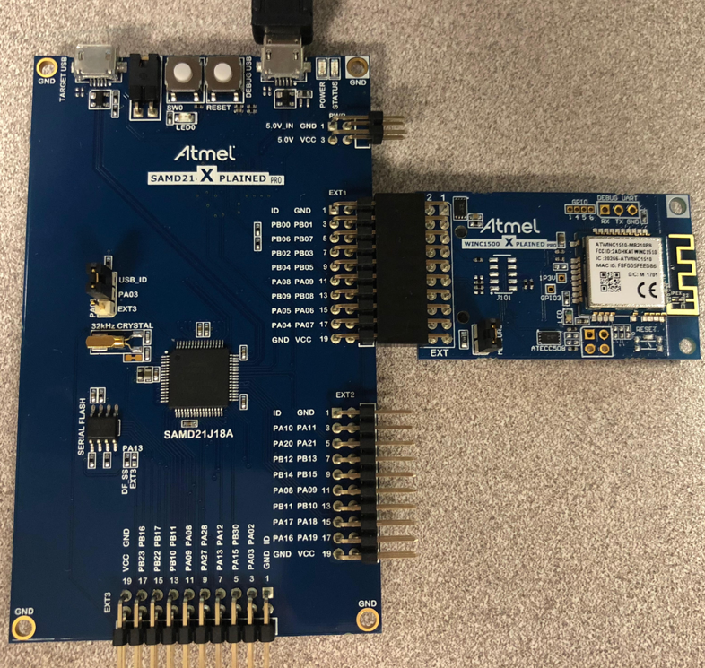
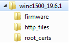

# WINC Firmware Update Guide
## MPLAB Harmony Integrated Software Framework

This document explains the WINC Firmware Upgrade Process.

## Description

The ATWINC1500 and ATWINC3400 WiFi devices require firmware to be loaded into flash memory to operate. These devices will come shipped with firmware preloaded, however it may become necessary to update this firmware to take advantage of fixes and new or expanded features. MPLAB Harmony 3 and later include the WINC Firmware Update utilities required to update the flash firmware of the WINC devices. These utilities can be found in the <install-dir>/utilities/wifi/winc directory.

User has to follow below steps to update the WINC module firmware
•	From the 'wireless_wifi' repo, at 'wireless_wifi\apps\serial_bridge' program the serial bridge application.
•	The application will put host device in serial bridge mode, where it will take the WINC module image from laptop utility and program into WINC module.
•	Below example show SAMD21 Xplained connected to WINC1500 Xplained on EXT1 for upgrading the WINC15x0 module firmware.

## Firmware Update Utilities

Updating a WINC device requires two utilities, an Image Tool which builds a file containing the changes required to the WINCs flash memory and a WINC Programming Tool which applies the changes to the WINC device.

### Image Tool

The Image Tool is responsible for constructing an image of the WINCs flash memory from components such as firmware files, certificates and other data and creating a change description file which can be passed to the WINC Programmer to be applied to a WINC device.
The Image Tool is located in the <install-dir>/utilities/wifi/winc directory. Each WINC firmware release will consists of a configuration file and a number of firmware and other files. The configuration file is presented to the Image Tool and is processed, in whole or in part to produce and output file. An example directory layout of a WINC firmware release is:

The configuration file, config.txt, is in the winc1500_19.6.1 directory. There are three subdirectories in this release:
• Firmware – contains firmware which runs on the WINC device.
• HTTP Files – contains files which are loaded into the HTTP web server made available by the WINC device when it
enters a provisioning Soft-AP mode.
• Root Certs – contains root certificates used to validate a TLS connection.

User can modify the config.txt file to add/remove devices certificate and customized the provisioning page. 

[root certificates] 
type is root certificates
schema is 2
size is 4K
default is 0xff

file is winc3400_1.3.1/root_certs/BaltimoreCyberTrustRoot.cer
file is winc3400_1.3.1/root_certs/DigiCert.cer
file is winc3400_1.3.1/root_certs/DigiCertSHA2.cer
file is winc3400_1.3.1/root_certs/EnTrust.cer
file is winc3400_1.3.1/root_certs/GeoTrust.cer
file is winc3400_1.3.1/root_certs/GlobalSignRoot.cer
file is winc3400_1.3.1/root_certs/cas.cer
file is winc3400_1.3.1/root_certs/caswin.cer
file is winc3400_1.3.1/root_certs/QuoVadis_Root.cer
file is winc3400_1.3.1/root_certs/VeriSign.cer

#### Generating Device Programming Files

The following command line will generate a device programming file winc1500_19.6.1.prog.

>image_tool.exe -c winc1500_19.6.1\config.txt -o winc1500_19.6.1.prog -of prog

The file produced can be used to upgrade a WINC1500 to version 19.6.1 including the firmware, HTTP files and root
certificates.

### WINC Programmer

The WINC Programmer is responsible for reading, erasing and writing the flash memory of the WINC device. A device programming file can be provided to the tool to update the flash memory contents. The WINC Programmer is located in the <install-dir>/utilities/wifi/winc directory.

#### Programming Device

The following command line will program a WINC1500 device via the serial port COM29.

>winc_programmer -p COM29 -d winc1500 -i winc1500_19.6.1.prog -if prog -w -r -pfw winc1500_19.6.1\firmware\programmer_firmware_3A0.bin

Output:

WINC Programming Tool 1.0.0 [r291] (Jun 27 2018)
Copyright (C) Microchip Technology Inc. 2018
WINC serial bridge found
chip ID is 0x001503a0
programming fw file: winc1500_19.6.1\firmware\programmer_firmware_3A0.bin
starting device
reinitialise serial bridge to 500000
waiting for firmware to run
flash ID 0x001440ef
flash size is 8 Mb
begin write operation
0x000000:[....w..w] 0x008000:[w.wwwwww] 0x010000:[wwwwwwww] 0x018000:[wwwwwwww]
0x020000:[wwwwwwww] 0x028000:[wwwwwwww] 0x030000:[wwwwwwww] 0x038000:[wwwwwwww]
0x040000:[wwwww...] 0x048000:[........] 0x050000:[........] 0x058000:[........]
0x060000:[........] 0x068000:[........] 0x070000:[........] 0x078000:[........]
0x080000:[........] 0x088000:[........] 0x090000:[........] 0x098000:[........]
0x0a0000:[........] 0x0a8000:[........] 0x0b0000:[........] 0x0b8000:[........]
0x0c0000:[........] 0x0c8000:[........] 0x0d0000:[........] 0x0d8000:[........]
0x0e0000:[........] 0x0e8000:[........] 0x0f0000:[........] 0x0f8000:[........]
begin read operation
0x000000:[rrrrrrrr] 0x008000:[rrrrrrrr] 0x010000:[rrrrrrrr] 0x018000:[rrrrrrrr]
0x020000:[rrrrrrrr] 0x028000:[rrrrrrrr] 0x030000:[rrrrrrrr] 0x038000:[rrrrrrrr]
0x040000:[rrrrrrrr] 0x048000:[rrrrrrrr] 0x050000:[rrrrrrrr] 0x058000:[rrrrrrrr]
0x060000:[rrrrrrrr] 0x068000:[rrrrrrrr] 0x070000:[rrrrrrrr] 0x078000:[rrrrrrrr]
0x080000:[rrrrrrrr] 0x088000:[rrrrrrrr] 0x090000:[rrrrrrrr] 0x098000:[rrrrrrrr]
0x0a0000:[rrrrrrrr] 0x0a8000:[rrrrrrrr] 0x0b0000:[rrrrrrrr] 0x0b8000:[rrrrrrrr]
0x0c0000:[rrrrrrrr] 0x0c8000:[rrrrrrrr] 0x0d0000:[rrrrrrrr] 0x0d8000:[rrrrrrrr]
0x0e0000:[rrrrrrrr] 0x0e8000:[rrrrrrrr] 0x0f0000:[rrrrrrrr] 0x0f8000:[rrrrrrrr]

verify range 0x000000 to 0x100000
begin verify operation
0x000000:[....p..v] 0x008000:[p.vvvvvv] 0x010000:[vvvvvvvv] 0x018000:[vvvvvvvv]
0x020000:[vvvvvvvv] 0x028000:[vvvvvvvv] 0x030000:[vvvvvvvv] 0x038000:[vvvvvvvv]
0x040000:[vvvvp...] 0x048000:[........] 0x050000:[........] 0x058000:[........]
0x060000:[........] 0x068000:[........] 0x070000:[........] 0x078000:[........]
0x080000:[........] 0x088000:[........] 0x090000:[........] 0x098000:[........]
0x0a0000:[........] 0x0a8000:[........] 0x0b0000:[........] 0x0b8000:[........]
0x0c0000:[........] 0x0c8000:[........] 0x0d0000:[........] 0x0d8000:[........]
0x0e0000:[........] 0x0e8000:[........] 0x0f0000:[........] 0x0f8000:[........]
verify passed

## Conclusion

Once verified, the Firmware has been updated. The WINC module now contains the updated Firmware and it can be used with any other application of choice.