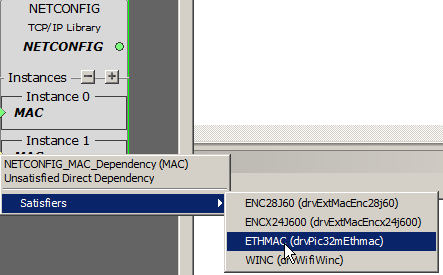
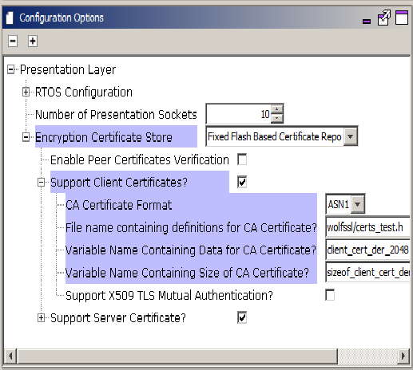

# MQTT System Service Configuration
The MQTT System Service library should be configured through the MHC. When user selects the MQTT System Service library, all the required dependencies components are added automatically in the MHC configuration.

The following figure shows the MHC configuration window for configuring the MQTT System Service and a brief description of various configuration options.
- Open the MHC 3
- Drag the MQTT Service Module into the Active components from the Available components
{:refdef: style="text-align: center;"}

{: refdef}

- Configure the various parameters of Basic Configuration
{:refdef: style="text-align: center;"}

{: refdef}

| Parameter Name | Default   Value | Description |
|-|-|-|
| Broker Name |  | Name of the MQTT   Broker Note: User should ensure that the Broker is UP and running. In case the connection timesout often, the User can modify the value of SYS_MQTT_PERIOIDC_TIMEOUT as per his requirement.  |
| Server Port |  | Port   number of the MQTT Broker at which the MQTT Client should connect |
| Enable TLS | FALSE | If   TRUE, the MQTT connection should use TLS while connecting to the broker. If   FALSE, the MQTT connection should not use TLS. Note: In case the TLS is enabled, the User needs to update the component 'Presentation Layer' with the CA Certificate format, location, name, and size. Other parameters can be updated as per the User's requirements. |
| Client Id |  | MQTT   Client Id should be unique for the Broker. If left empty, the Id will be   generated randomly |
| Network Interface |  | Network Interface - Wifi or Ethernet on which the MQTT Client should run. On choosing Ethernet, the MHC will add EthMAC, MIIM, and LAM8740 Components. The User needs to attach the EthMAC to the NetConfig (in System Component Window) via the MAC parameter in Instance 1 |

- Configure the various parameters of Presentation Layer if TLS enabled
{:refdef: style="text-align: center;"}

{: refdef}

- Configure the various parameters of 'Advanced Configuration' of the MQTT Service
{:refdef: style="text-align: center;"}

{: refdef}

| Parameter Name | Default   Value | Description |
|-|-|-|
| Enable   Auto Reconnect | TRUE | If TRUE, the MQTT Service will auto reconnect to the Broker if   connection is broken. If FALSE, the customer application needs to take care   of triggering the connection process again. |
| Enable   Clean Session | TRUE | If TRUE, the MQTT Client shall tell the Broker that the session is   clean, else it will let the Broker know that the Session is a continuation of   the previous session |
| KeepAlive Interval | 60 sec | If no   data flows over an open connection for a certain KeepAliveInterval then the   client will generate a PINGREQ and expect to receive a PINGRESP from the   broker. This message exchange confirms that the connection is open and   working |
| Username/   Password | Disabled | In case   the connection to Broker needs a Username and Password |
| Last   Will and testament | Disabled | LWT   Configuration has the following parameters –           1. Topic,           2. QoS,           3. Retain, and           4. Message  This   ‘Message’ will be sent on the ‘Topic’ whenever the Broker finds that there is   an ungraceful disconnection with the Client. |

- Configure the remaining parameters
{:refdef: style="text-align: center;"}

{: refdef}

| Parameter Name | Default   Value | Description |
|-|-|-|
| Subscription Topic | Disabled | Subscription configuration has 2 Parameters –       1.	Topic and       2.	Qos. (0 (Atmost Once),                  1 (Atleast Once),                 2 (Exactly Once))      The User can configure these parameters to subscribe to a Topic to receive   messages. |
| Publish to Topic | Disabled | Publishing a message to Topic has 3 Parameters –         1. Topic and       2. Qos ( 0 (Atmost Once), 1 (Atleast Once), 2 (Exactly Once))      3. Retain: If the Broker should retain the message      The User can configure these parameters to and use them along with the   message to send it on a particular Topic. |
| Enable CLI Commands | Enabled | Enabling this flag compiles in the CLI commands related to Mqtt Service. The user can use these CLI commands to connect/ disconnect, subscribe/ unsusbscribe, publish messages onto a topic.|
| Enable Debug Logs | Disabled | Enabling this flag compiles in debug logs and user can enable them   at runtime. The user can use the following CLI commands to enable/ disable   levels and flows for the MQTT service:      1.	sysmqtt debug level <value>       2.	sysmqtt debug flow <value>  Note: In case the user enables debug logs, user needs to manually add the 'App Debug Service' component from Wireless-> System Service-> App Debug Service.|

All of the required files are automatically added into the MPLAB X IDE project by the MHC when the MQTT Service is selected for use.
