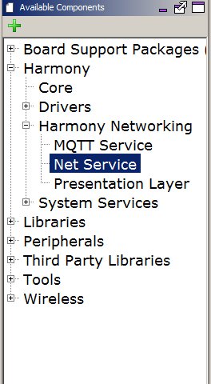
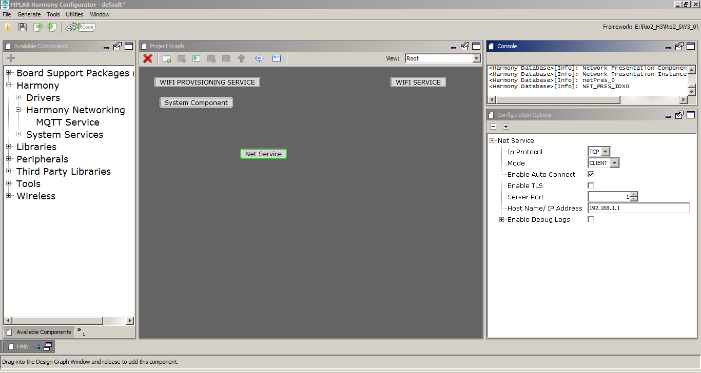
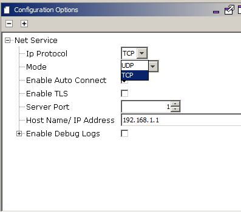
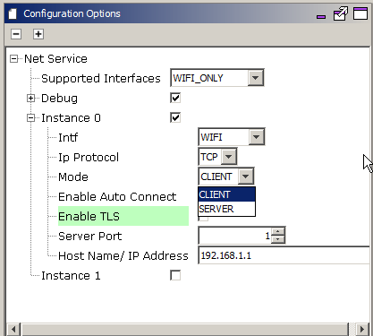

# Net System Service Configuration
The NET System Service library should be configured through the MHC. When user selects the NET System Service library, all the required dependencies components are added automatically in the MHC configuration. In the NET System Service library, user can select the mode as Client or Server and make a required changes for the selected mode.

The following figure shows the MHC configuration window for configuring the NET System Service and a brief description of various configuration options.
1. Open the MHC 3
2. Drag the Net Service Module into the Active components from the Available components

3. Configure the various parameters

4. Configure the Ip Protocol as either TCP or UDP

5. Configure the Mode as either Client or Server

6. Enable/ Disable "Auto Connect" as per your requirement. This parameter when enabled ensures that if the NET Connection disconnects, the service internally tries to reconnect. By Default, the parameter value is 'True'.
7. Enable/ Disable "Enable TLS" in case the connection needs to be secured. Please note that in case this parameter is Enabled, the User needs to configure the WolfSSL related configuration on his own. Also, this parameter is valid only for TCP Connections. By Default, the parameter value is 'False'.
8. Server Port - 1-65535. This is a mandatory parameter.
9. Host Name/ IP Address: Can be a Host Name or an IP Address. By Default, the parameter value is '192.168.1.1'.
10. Enable Debug Logs in case more prints are required for debugging. By Default, the parameter value is 'False'.

All of the required files are automatically added into the MPLAB X IDE project by the MHC when the Net Service is selected for use.
