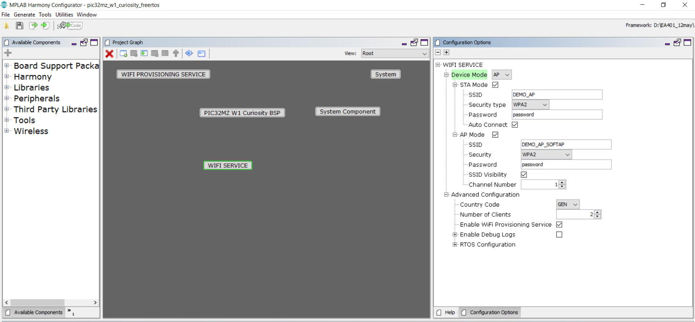

# Wi-Fi System Service Configuration
The Wi-Fi System Service library should be configured through MHC(MPLAB Harmony Configurator). The following figure shows the MHC configuration window for configuring the Wi-Fi System Service and a brief description of various configuration options. 

When user select the Wi-Fi System Service library, all the required dependencies are added automatically into the MHC configuration. In the Wi-Fi System Service library, user can select the operating device mode as station(STA) or access point(AP) and make a required changes in the selected mode. 

## Configuration Options:

 Using MHC menu,user can select required device mode as a station(STA)
or access point(AP)

#### Device Mode:
    Indicates the device operation mode(STA/AP).

#### STA Mode:
    
    SSID: 
        Access Point (AP/Router) SSID to connect.
    
    Security type :
        Indicates the security being used by the AP with which device should connect – OPEN / WPA2 / WPAWPA2 (Mixed)/ WPA3.    
    
    Password:
        Password to be used while connecting to the AP. 
        This is mandatory if security mode is set to anything other than OPEN. 
        It will be ignored if security mode is set to OPEN.
    
    Auto Connect:
        Indicate whether to auto connect to AP (enable) or wait for user input (disable).

#### AP Mode:
    
    SSID:
        Indicate AP mode SSID.
    
    Security:
        Indicate AP mode security: 
            - OPEN
            - WPA2
            - WPAWPA2(Mixed)
            - WPA3
            
    Password:
        Indicate AP mode password(passphrase).
    
    SSID Visibility:
        Indicate AP mode SSID visibility.
    
    Channel:
        Indicate operating channel of AP mode.

#### Advanced configuration:
    
    Country code:
      Regulatory domain country code configuration:
        - GEN - General
        - USA - North America
        - EMEA - Europe
        - JPN - Japan

    Number of Clients:
        Indicates the maximum number of clients user can register.

    Enable Wi-Fi Provisioning service:
        Enables/Disables Wi-Fi Provisioning System Service  functionality along with Wi-Fi System Service.
    
    Enable Debug Logs:
        Enables/Disables Wi-Fi and Wi-Fi Provisioning System Service flows and levels.
    
      
## Enabling Wi-Fi System Service

All of the required files are automatically added into the MPLAB X IDE
project by the MHC when the library is selected for use.
