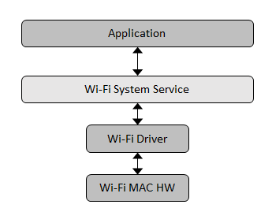
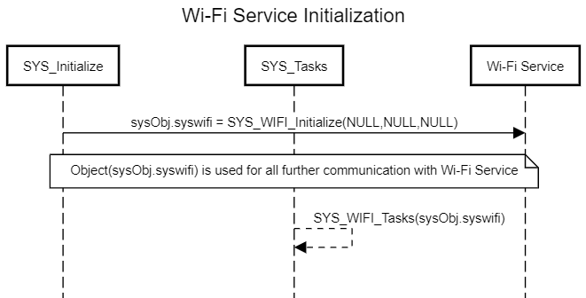
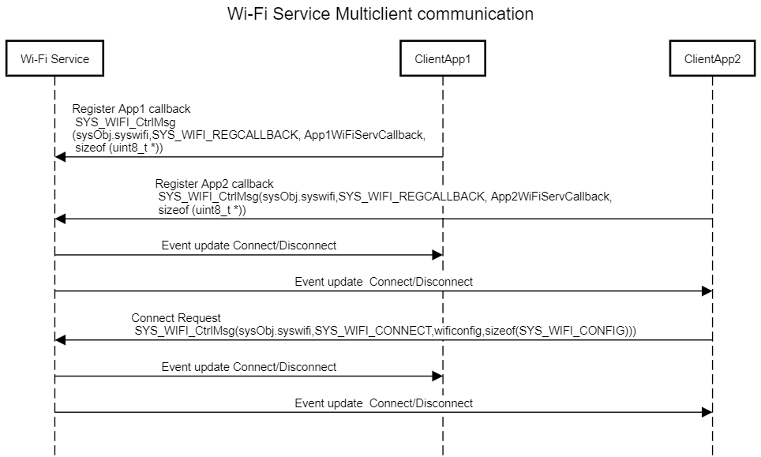

---
grand_parent: Services
parent: Wi-Fi Service
title: Wi-Fi System Service Usage
has_toc: true
nav_order: 1
---

# Wi-Fi System Service Usage

## Abstraction Model

The Wi-Fi System Service library provides an abstraction to the Wi-Fi driver API's to provide following functionalities.

- Simple APIs to enable/disable STA mode 
- Simple APIs to enable/disable AP mode 
- Self Healing 
- Reduce code user has to write 
- Reduce time to develop and maintain 
 
The following diagram depicts the Wi-Fi System Service abstraction model. 

## How The Library Works

By default, MHC generated code provides all the functionalities to
enable STA or AP mode application. User needs to configure the required
STA or AP mode configuration using MHC. 

Multiple clients can register for callbacks to the Wi-Fi System Service
Library for getting Wi-Fi connectivity update information. Additionally
clients can make request to the Wi-Fi System Service Library using
SYS\_WIFI\_CtrlMsg() API. More information can be found in the
SYS\_WIFI\_CtrlMsg examples. 

