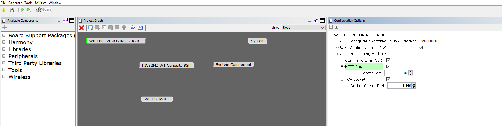

# Wi-Fi provisioning System Service Configuration

The Wi-Fi Provisioning System Service library should be configured through MHC(MPLAB Harmony Configurator). The following figure shows the MHC configuration window for configuring the Wi-Fi Provisioning System Service and a brief description of various configuration options. 

 

The Wi-Fi Provisioning System Service library MHC menu provide option to enable required Wi-Fi Provisioning methods base on user application requirements. User can select Command line , Socket mode and HTTP as shown in below diagram. 

## Configuration Options:

- WiFi Configuration Stored at NVM Address(Program Flash memory): 
    - NVM Address for storing Wi-Fi Configuration. 
    - User can change this configuration value with program flash memory page aligned address. 
    - User has to make sure the NVM address(Program Flash memory) page is not overwritten by application code.

- Save Configuration in the NVM(Program flash memory): 
    - Indicates the Wi-Fi configuration storing in the NVM. 
    - This configuration is only valid when "Enable Wi-Fi Provisioning service" is enabled. 
 
Wi-Fi Provisioning Methods  
- Command Line(CLI): 
    - Enable/Disable Wi-Fi Provision using command line. 

- HTTP pages: 
    - Enable/Disable Wi-Fi Provision using HTTP pages(webpage).
    -  HTTP Socket Number:   
        - User configuration for HTTP Server Socket. 
        - Defult port number is 80.   

- TCP socket: 
    -  Enable/Disable Wi-Fi Provision using TCP Socket. 
    -  TCP Socket Number: 
        - User configuration for TCP Server Socket. 
        - Defult port number is 6666.
 TCP Socket port number is used by Mobile Applicaiton and JSON.
 

